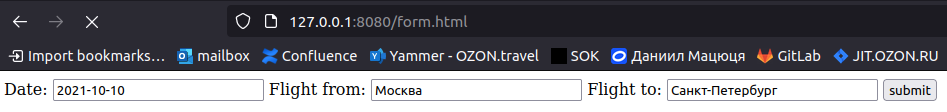
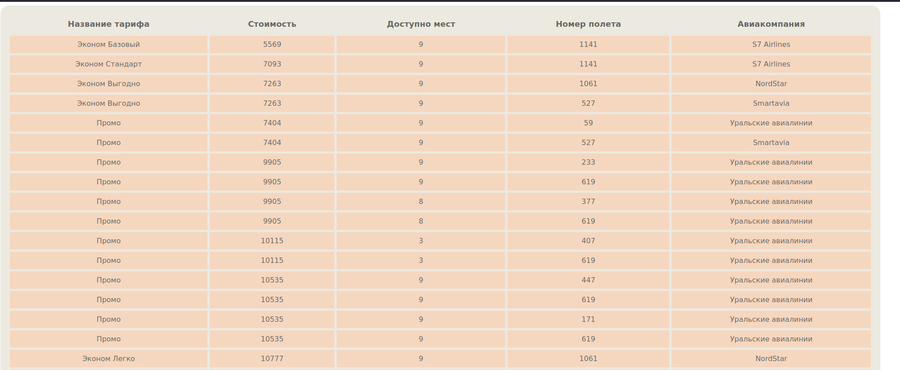

# Обертка над апи OZON travel

Это просто тренировочный проект. 

Для запуска введите в консоли:
```
docker-compose up --build
```

Или запустите сервис локально:  
```
go run server.go
```
Как только сервис поднимется, вы можете перейти в своем браузере на страницу
```
127.0.0.1:8080/form.html
```

В форму надо ввести три параметра:
- дату отправления в формате yyyy-mm-dd
- город отправления
- город прибытия

После чего подтвердить отправку данных и ожидать таблицу с выводом тарифов.
Если внешняя апишка не затаймаутится, то вы увидите выдачу, как на скриншоте ниже:
